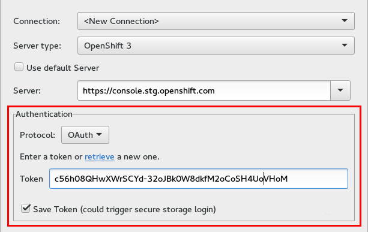
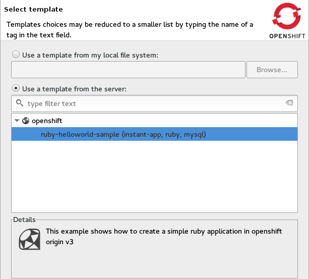
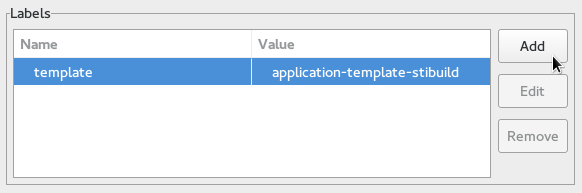
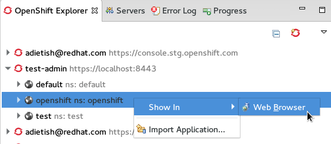
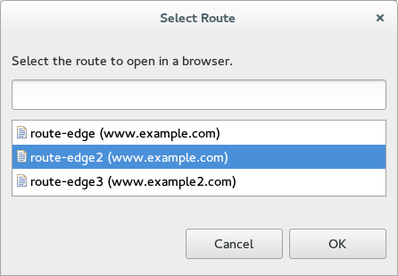
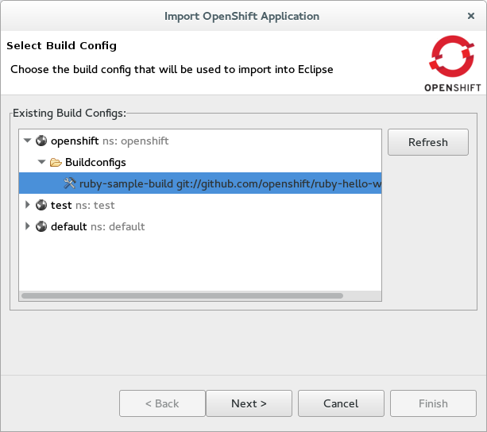
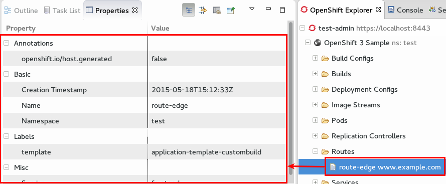
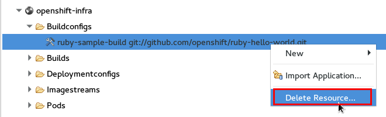

= OpenShift What's New in OpenShift 3.0.0.Beta1
:page-layout: whatsnew
:page-component_id: openshift
:page-component_version: 3.0.0.Beta1
:page-product_id: jbt_core 
:page-product_version: 4.3.0.Beta1

== Authenticate using OAuth
Starting with JBoss Tools 4.3.0.Beta1 you can now connect and authenticate to an OpenShift v3 server using Google OAuth. 
You can retrieve your token clicking the link that we provide, copy it in the browser that gets opened and paste it back into the form.  

 
related_jira::JBIDE-19829[]

== Create from template
You can now use templates to create OpenShift resources with JBoss Tools. 
The wizard allows you to use a template offered by the server but you can also choose to provide a template that you have ready on your disk.
 

Once the template is selected you can edit the template parameters.

image:./images/edit-template-parameters.png[]

You can add labels so that you will be able to reference those new resources once they are created.

related_jira::JBIDE-19009[]

== Show Application in Browser
You can easily point your browser to your OpenShift application via the context menu. 
Pick your project in the OpenShift explorer and choose menu:[Show In>Web Browser] and we will open it up in the browser.

 
To figure out what url we need to open, we look at the routes in your OpenShift project. 
Given there are several ones we will allow you to choose which one to point your browser to.

related_jira::JBIDE-19849[]

== Import to Eclipse project
An OpenShift project can now get imported to Eclipse in JBoss Tools. 
The import wizard prompts you to select a build config since it contains the uri of your source repository. 
The wizard then clones the given git uri and import the code within it to your Eclipse workspace/project. 

It currently detects maven projects and imports those a such. 
All other projects will get imported as general projects that you can manually configure to match your needs. 
We will obviously improve this detection in upcoming releases via the new Eclipse https://wiki.eclipse.org/E4/UI/Smart_Import["Smart Import"] facility.     

related_jira::JBIDE-19787[]

== Show routes
4.3.0.Beta1 will show you routes in the OpenShift Explorer that you have defined in your OpenShift project. 
The properties view unveils all details for the selected route.

related_jira::JBIDE-19760[]

== Delete Resources
You can now delete resource that you browse in the OpenShift explorer.

related_jira::JBIDE-19008[]

